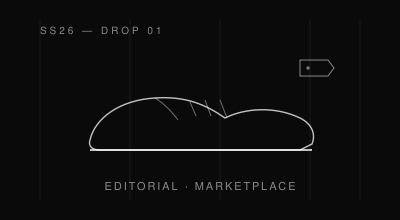
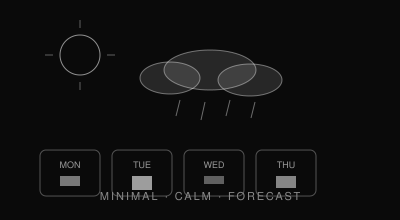
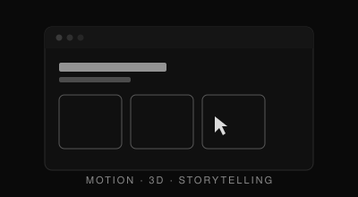

  

  

  

<a href="#-about">ABOUT</a>&nbsp;&nbsp;/&nbsp;&nbsp;<a href="#-selected-work">WORK</a>&nbsp;&nbsp;/&nbsp;&nbsp;<a href="#-skills-universe">SKILLS</a>&nbsp;&nbsp;/&nbsp;&nbsp;<a href="#-journey">JOURNEY</a>&nbsp;&nbsp;/&nbsp;&nbsp;<a href="#-ai-playground">AI LAB</a>&nbsp;&nbsp;/&nbsp;&nbsp;<a href="#-github-analytics">ANALYTICS</a>&nbsp;&nbsp;/&nbsp;&nbsp;<a href="#-frame">FRAME</a>&nbsp;&nbsp;/&nbsp;&nbsp;<a href="#-connect">CONNECT</a>

 

## 🖤 About

<table width="100%">
<tr>
<td width="46%" valign="top">

</td>
<td width="54%" valign="top">

 

<table width="100%">
<tr>
<td width="50%" valign="top">
 

**◆ PRODUCT THINKING**
I start from the problem, not the pixel — user flows and information architecture that hold up under real use.
  
</td>
<td width="50%" valign="top">
 

**◆ DESIGN PHILOSOPHY**
Interfaces should feel inevitable. Every element earns its place; nothing is decoration.
  
</td>
</tr>
<tr>
<td width="50%" valign="top">

**◆ ENGINEERING**
I build what I design. Full-stack execution keeps the idea honest all the way to production.
  
</td>
<td width="50%" valign="top">

**◆ AI CURIOSITY**
Computer vision, applied ML, and Three.js — where the interface starts to think.
  
</td>
</tr>
</table>

</td>
</tr>
</table>

 

### GOOD DESIGN IS INVISIBLE.
It doesn't ask for attention — it earns trust quietly, one considered decision at a time.

 

## 💼 Selected Work

 

<table width="100%">
<tr>
<td width="50%" valign="top">

**AkashaLens** &nbsp;◆ ACTIVE
 Cloud removal and image reconstruction for satellite imagery.

  

**[↗ Repository](https://github.com/Samudra-GITHub/AkashaLens)**

</td>
<td width="50%" valign="top">

**Krama** &nbsp;◆ CONCEPT
 A premium sneaker marketplace, shaped by fashion editorial.

  

**[↗ Repository](https://github.com/Samudra-GITHub/Krama)**

</td>
</tr>
<tr>
<td width="50%" valign="top">

**SkyCast** &nbsp;◆ SHIPPED
 A minimal forecast dashboard, built for calm comprehension.

  

**[↗ Repository](https://github.com/Samudra-GITHub/SkyCast-Weather-App)**

</td>
<td width="50%" valign="top">

**Portfolio** &nbsp;◆ LIVE
 A digital space with a point of view — motion, 3D, storytelling.

  

**[↗ Live Site](https://mudra-kar-portfolio-g46m.vercel.app)** &nbsp;·&nbsp; **[Repository](https://github.com/Samudra-GITHub/samudra-kar-portfolio)**

</td>
</tr>
</table>

 

## 🛠️ Skills Universe

 

<table width="100%">
<tr>
<td width="45%" valign="top">

</td>
<td width="55%" valign="top">

 

<table width="100%">
<tr><td valign="top">

**FRONTEND**
 React · TypeScript · Tailwind CSS · Three.js / R3F
  

**BACKEND**
 Node.js · FastAPI · Flask · Firebase · MongoDB
  

</td></tr>
<tr><td valign="top">

**AI / ML**
 Python · TensorFlow · OpenCV · Deep Learning
  

**DESIGN & TOOLS**
 Figma · Git · GitHub · VS Code · C · Java
  

</td></tr>
</table>

</td>
</tr>
</table>

 

## 🧭 Journey

 

 

<b>🏆 Featured Hackathons &amp; Programs</b>

 

| Program | Focus |
|:--|:--|
| **Smart India Hackathon (SIH)** | National-level product problem-solving under time pressure |
| **AkashaLens** | Independent computer-vision research project, built outside a classroom setting |
| **Campus build sprints** | Rapid prototyping across UI/UX and full-stack tracks |

 

## 🧪 AI Playground

Where the interface starts to think.

  

<table width="100%">
<tr>
<td width="33%" align="center" valign="top">

**Satellite Reconstruction**
 Cloud removal · in-fill · AkashaLens

</td>
<td width="33%" align="center" valign="top">

**Computer Vision**
 Image segmentation · OpenCV pipelines

</td>
<td width="33%" align="center" valign="top">

**Applied ML**
 TensorFlow experiments · model tuning

</td>
</tr>
</table>

 

## 🌱 Building Now

 

| Area | Progress |
|:--|:--|
| AI + Computer Vision | `████████████░░░░░░░░` 60% |
| Three.js / React Three Fiber | `██████████░░░░░░░░░░` 50% |
| Backend Architecture | `██████████████░░░░░░` 70% |
| Design Systems | `████████████████░░░░` 80% |

 

**Open to:** AI and design-driven products · UI/UX and frontend collaborations · open-source contributions · well-scoped problems with thoughtful teams.

 

## 📊 GitHub Analytics

Building consistently. Shipping ideas into products.

  

 

  

  

<picture>
  <source media="(prefers-color-scheme: dark)" srcset="https://raw.githubusercontent.com/Samudra-GITHub/Samudra-GITHub/output/github-contribution-grid-snake-dark.svg" />
  <source media="(prefers-color-scheme: light)" srcset="https://raw.githubusercontent.com/Samudra-GITHub/Samudra-GITHub/output/github-contribution-grid-snake.svg" />
  
</picture>

  

 

## 📷 Frame

Personal work, off-screen. Bangalore street, product studies, mobile edits.

 

 

gallery placeholders — swap in real frames anytime

 

## 🎮 Playground

 

<table width="100%">
<tr>
<td width="25%" align="center" valign="top">

**💬 QUOTE**
 "Simplicity is the ultimate sophistication." — Leonardo da Vinci

</td>
<td width="25%" align="center" valign="top">

**📍 BASE**
 Bangalore, India IST (UTC+5:30)

</td>
<td width="25%" align="center" valign="top">

**🕐 CODING SINCE**
 2022 Still going.

</td>
<td width="25%" align="center" valign="top">

**☕ FUEL**
 Immeasurable Renewable.

</td>
</tr>
</table>

 

 

## 📫 Connect

  

### *"The best design is the one that makes the right thing feel natural."*

 

✦ Designed and built by <b>Samudra Kar</b> · Bangalore, India ✦

