 

[Email](mailto:hi.samsstudio@gmail.com) &nbsp;·&nbsp; [GitHub](https://github.com/Samudra-GITHub) &nbsp;·&nbsp; [LinkedIn](https://www.linkedin.com/in/samudra-kar-a495951b5/) &nbsp;·&nbsp; [Portfolio](https://mudra-kar-portfolio-g46m.vercel.app)

 

[Products](#featured-products) &nbsp;/&nbsp; [About](#about) &nbsp;/&nbsp; [Stack](#tech-stack) &nbsp;/&nbsp; [Focus](#current-focus) &nbsp;/&nbsp; [Analytics](#github-analytics) &nbsp;/&nbsp; [Roadmap](#roadmap-2026) &nbsp;/&nbsp; [Connect](#connect)

 

## Featured Products

Samudra OS — a connected set of products spanning design, AI, and engineering.

 

<table width="100%">
<tr>
<td width="100%">

**Tarang** — flagship
 Music, redesigned for the web.
 Next.js · React · TypeScript · Tailwind CSS · Framer Motion &nbsp; `IN DEVELOPMENT`
 **[Repository →](https://github.com/Samudra-GITHub/Tarang)**

</td>
</tr>
</table>

 

<table width="100%">
<tr>
<td width="50%" valign="top">

**Rinti AI**
 Your intelligent AI workspace.
 FastAPI · Python · Next.js · Groq · Tavily &nbsp; `IN DEVELOPMENT`
 **[Repository →](https://github.com/Samudra-GITHub/Rinti-Ai)**

</td>
<td width="50%" valign="top">

**AkashaLens**
 AI-powered satellite cloud reconstruction.
 Python · OpenCV · NumPy · Deep Learning &nbsp; `RESEARCH`
 **[Repository →](https://github.com/Samudra-GITHub/AkashaLens)**

</td>
</tr>
<tr><td colspan="2">&nbsp;</td></tr>
<tr>
<td width="50%" valign="top">

**Krama**
 Luxury sneaker marketplace.
 Next.js · React · TypeScript · Tailwind CSS &nbsp; `CONCEPT`
 **[Repository →](https://github.com/Samudra-GITHub/Krama)**

</td>
<td width="50%" valign="top">

**PRAHARI**
 AI-powered mine compliance & safety monitoring platform.
 Next.js · TypeScript · Prisma · PostgreSQL &nbsp; `HACKATHON`
 **[Repository →](https://github.com/Samudra-GITHub/PRAHARI)**

</td>
</tr>
<tr><td colspan="2">&nbsp;</td></tr>
<tr>
<td width="50%" valign="top">

**Portfolio V2**
 Interactive developer portfolio.
 Next.js · React · Three.js · Framer Motion &nbsp; `LIVE`
 **[Live Site →](https://mudra-kar-portfolio-g46m.vercel.app)**

</td>
<td width="50%" valign="top">

</td>
</tr>
</table>

 

## About

I'm a Computer Science Engineering student, UI/UX designer, full-stack developer, and AI builder based in Bangalore, India.

My work spans product design, frontend engineering, and applied machine learning — from glassmorphic web interfaces to computer-vision research. I care about interfaces that feel inevitable and systems that hold up under real use.

 

## Tech Stack

**Languages**
 

**Frontend**
 

**Backend**
 

**AI**
 

**Design**
 

**Tools**
 

 

## Current Focus

- **Tarang** — shipping the UI/UX and motion system for the flagship music product
- **Rinti AI** — building memory, research mode, and streaming responses
- **AkashaLens** — deepening the satellite cloud-reconstruction pipeline
- **Krama** — refining the marketplace design system
- **Portfolio V2** — relaunching with new case studies and motion work

 

## GitHub Analytics

 

 

<picture>
  <source media="(prefers-color-scheme: dark)" srcset="https://raw.githubusercontent.com/Samudra-GITHub/Samudra-GITHub/output/github-contribution-grid-snake-dark.svg" />
  <source media="(prefers-color-scheme: light)" srcset="https://raw.githubusercontent.com/Samudra-GITHub/Samudra-GITHub/output/github-contribution-grid-snake.svg" />
  
</picture>

 

## Roadmap 2026

- [x] Ship Tarang v1 — glassmorphism music streaming UI
- [x] Launch AkashaLens satellite reconstruction pipeline
- [ ] Add playlists, lyrics, and AI recommendations to Tarang
- [ ] Ship Rinti AI research mode and streaming responses
- [ ] Open-source the Krama design system
- [ ] Publish Portfolio V2 case studies
- [ ] Push AkashaLens toward ISRO-grade reconstruction accuracy

 

## Connect

[Email](mailto:hi.samsstudio@gmail.com) &nbsp;·&nbsp; [GitHub](https://github.com/Samudra-GITHub) &nbsp;·&nbsp; [LinkedIn](https://www.linkedin.com/in/samudra-kar-a495951b5/) &nbsp;·&nbsp; [Portfolio](https://mudra-kar-portfolio-g46m.vercel.app)

 

Samudra Kar &nbsp;·&nbsp; Bangalore, India

