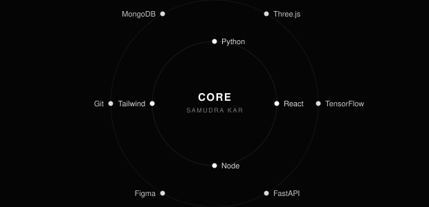
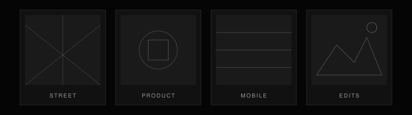

 

 

 

<a href="#about-me">ABOUT</a>&nbsp;&nbsp;&nbsp;<a href="#featured-work">WORK</a>&nbsp;&nbsp;&nbsp;<a href="#skills-and-technologies">SKILLS</a>&nbsp;&nbsp;&nbsp;<a href="#journey">JOURNEY</a>&nbsp;&nbsp;&nbsp;<a href="#github-analytics">ANALYTICS</a>&nbsp;&nbsp;&nbsp;<a href="#connect">CONNECT</a>

 

<!-- ============================================= -->
<!-- ABOUT                                          -->
<!-- ============================================= -->

&nbsp;&nbsp;02 — ABOUT

# About Me

<table width="100%">
<tr>
<td width="46%" valign="top">

</td>
<td width="54%" valign="top">

 

I sit at the intersection of **product thinking, visual design, and engineering** — with a deepening focus on applied artificial intelligence and computer vision.

I believe the best technology disappears. It doesn't ask for attention; it earns trust quietly, one considered decision at a time.

 

**Product Thinking** — I start from the problem, not the pixel.
**Design Philosophy** — every element earns its place; nothing is decoration.
**Engineering** — I build what I design, end to end.
**AI Curiosity** — computer vision, applied ML, Three.js — where the interface starts to think.

</td>
</tr>
</table>

 

# Good design is invisible.
It doesn't ask for attention — it earns trust quietly, one considered decision at a time.

 

<!-- ============================================= -->
<!-- FEATURED WORK                                  -->
<!-- ============================================= -->

&nbsp;&nbsp;03 — WORK

# Featured Work
Four products. Four different problems.

 

### AkashaLens
SATELLITE IMAGERY &nbsp;·&nbsp; ACTIVE

AI-powered computer vision exploring cloud removal and image reconstruction for satellite imagery — reconstructing occluded ground detail with minimal artifacting.

   

**[View Repository →](https://github.com/Samudra-GITHub/AkashaLens)**

 

<table width="100%">
<tr>
<td width="58%" valign="top">

</td>
<td width="42%" valign="top">

 

FLAGSHIP PROJECT &nbsp;·&nbsp; CONCEPT

### Krama

A premium sneaker marketplace concept — shaped by fashion, editorial layout, and a tactile shopping experience. Designed like a launch page, not a storefront.

 

  

 

**[View Repository →](https://github.com/Samudra-GITHub/Krama)**

</td>
</tr>
</table>

 

<table width="100%">
<tr>
<td width="58%" valign="top">

</td>
<td width="42%" valign="top">

 

WEATHER DASHBOARD &nbsp;·&nbsp; SHIPPED

### SkyCast

A minimal forecast dashboard designed around quick comprehension and a calm visual hierarchy — every panel earns its place on screen.

 

  

 

**[View Repository →](https://github.com/Samudra-GITHub/SkyCast-Weather-App)**

</td>
</tr>
</table>

 

<table width="100%">
<tr>
<td width="58%" valign="top">

</td>
<td width="42%" valign="top">

 

PERSONAL SITE &nbsp;·&nbsp; LIVE

### Portfolio

A digital space with a point of view — motion, 3D, and visual storytelling built to communicate range across design and engineering.

 

  

 

**[View Live →](https://mudra-kar-portfolio-g46m.vercel.app)** &nbsp;·&nbsp; **[Repository](https://github.com/Samudra-GITHub/samudra-kar-portfolio)**

</td>
</tr>
</table>

 

<!-- ============================================= -->
<!-- SKILLS & TECHNOLOGIES                          -->
<!-- ============================================= -->

&nbsp;&nbsp;04 — SKILLS

# Skills and Technologies
The tools behind the work.

 

 

**Frontend**
 
   

 

**Backend**
 
    

 

**AI / ML**
 
  

 

**Design & Tools**
 
   

 

<!-- ============================================= -->
<!-- JOURNEY                                        -->
<!-- ============================================= -->

05 — JOURNEY

# Journey
From first line of code to what's next.

 

 

<!-- ============================================= -->
<!-- WHAT I'M BUILDING                              -->
<!-- ============================================= -->

06 — BUILDING

# What I'm Building
Skills currently in progress, tracked honestly.

 

 

Open to: AI &amp; design-driven products · UI/UX and frontend collaborations · open-source contributions · well-scoped problems with thoughtful teams.

 

<!-- ============================================= -->
<!-- BIG STATEMENT                                  -->
<!-- ============================================= -->

# Simplicity, executed well, is indistinguishable from magic.

 

<!-- ============================================= -->
<!-- AI PLAYGROUND & HACKATHONS                     -->
<!-- ============================================= -->

&nbsp;&nbsp;07 — LAB

# AI Playground and Hackathons
Where the interface starts to think — and where it gets tested under pressure.

 

 

<table width="100%">
<tr>
<td width="33%" align="center" valign="top">

**Satellite Reconstruction**
 Cloud removal · in-fill · AkashaLens

</td>
<td width="33%" align="center" valign="top">

**Computer Vision**
 Image segmentation · OpenCV pipelines

</td>
<td width="33%" align="center" valign="top">

**Applied ML**
 TensorFlow experiments · model tuning

</td>
</tr>
</table>

 

<table width="100%">
<tr>
<td width="33%" align="center" valign="top">

**◆ Smart India Hackathon**
 National-level product problem-solving under time pressure

</td>
<td width="33%" align="center" valign="top">

**◆ AkashaLens Research**
 Independent computer-vision project, built outside a classroom setting

</td>
<td width="33%" align="center" valign="top">

**◆ Campus Build Sprints**
 Rapid prototyping across UI/UX and full-stack tracks

</td>
</tr>
</table>

 

<!-- ============================================= -->
<!-- GITHUB ANALYTICS                               -->
<!-- ============================================= -->

08 — ANALYTICS

# GitHub Analytics
Building consistently. Shipping ideas into products.

 

 

 

 

<picture>
  <source media="(prefers-color-scheme: dark)" srcset="https://raw.githubusercontent.com/Samudra-GITHub/Samudra-GITHub/output/github-contribution-grid-snake-dark.svg" />
  <source media="(prefers-color-scheme: light)" srcset="https://raw.githubusercontent.com/Samudra-GITHub/Samudra-GITHub/output/github-contribution-grid-snake.svg" />
  
</picture>

 

 

<!-- ============================================= -->
<!-- PHOTOGRAPHY & INTERESTS                        -->
<!-- ============================================= -->

&nbsp;&nbsp;09 — INTERESTS

# Photography and Personal Interests
Personal work, off-screen.

 

 
gallery placeholders — ready for real frames anytime

 

<table width="100%">
<tr>
<td width="25%" align="center" valign="top">

**Quote**
 "Simplicity is the ultimate sophistication." — Leonardo da Vinci

</td>
<td width="25%" align="center" valign="top">

**Base**
 Bangalore, India IST (UTC+5:30)

</td>
<td width="25%" align="center" valign="top">

**Coding Since**
 2022 · still going

</td>
<td width="25%" align="center" valign="top">

**Fuel**
 Immeasurable · renewable

</td>
</tr>
</table>

 

<!-- ============================================= -->
<!-- CONNECT                                        -->
<!-- ============================================= -->

10 — CONNECT

# Connect
Open to design-driven products, frontend collaborations, and well-scoped problems.

 

 

 

# "The best design is the one that makes the right thing feel natural."

 

Designed and built by <b>Samudra Kar</b> · Bangalore, India

