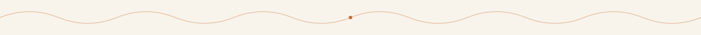
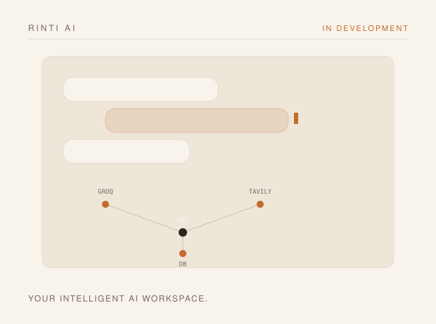
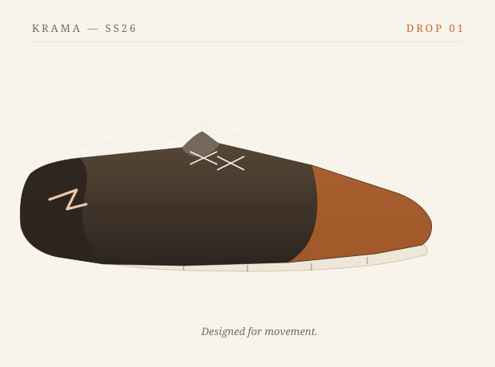
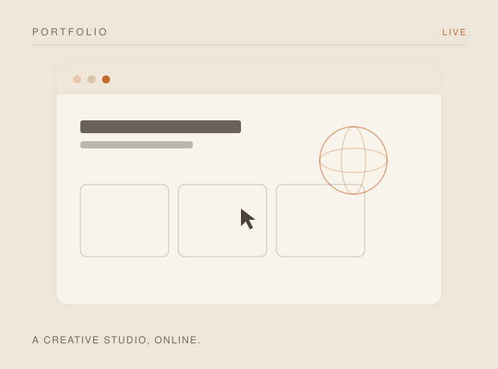
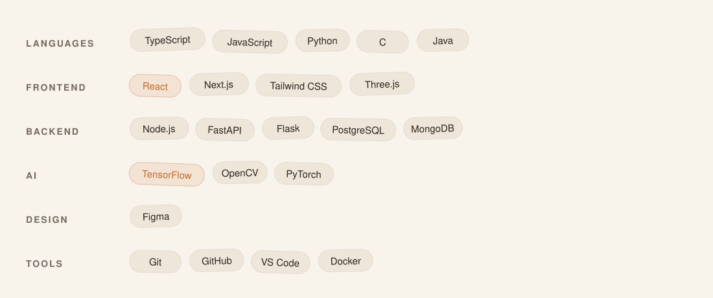
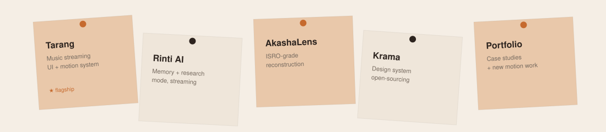
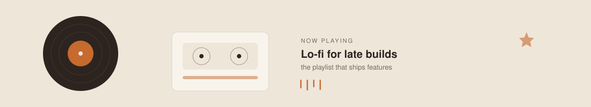

 

<a href="#about">About</a> &nbsp;·&nbsp;
<a href="#featured-products">Featured Products</a> &nbsp;·&nbsp;
<a href="#tech-stack">Tech Stack</a> &nbsp;·&nbsp;
<a href="#github-journey">Journey</a> &nbsp;·&nbsp;
<a href="#currently-building">Currently Building</a> &nbsp;·&nbsp;
<a href="#connect">Connect</a>

 

## About

I'm a Computer Science Engineering student, UI/UX designer, and full-stack builder working out of Bangalore. Somewhere along the way I picked up a camera too, and now half my reference folders are photos I took myself instead of screenshots I saved.

Most of what I build lives at the edge of a few things at once — product thinking, visual design, and enough engineering to actually ship it. I like AI best when it disappears into the product instead of being the headline. A copilot is more interesting to me than a chatbot; a recommendation is more interesting than a leaderboard.

I'm slow to add a feature and quick to cut one. If two things compete for attention on a screen, one of them loses.

 

<em>"Build the thing you'd actually want to open twice."</em>

 

## Featured Products

Every product here belongs to **Sams Studio** — a connected set of things I've built, spanning design, AI, and engineering.

 

<table width="100%">
<tr>
<td width="55%" valign="top">

</td>
<td width="45%" valign="top">

 

SAMS STUDIO &nbsp;·&nbsp; FLAGSHIP

### Tarang
**Music, redesigned for the web.**

A premium music streaming web app built around motion, glass surfaces, and a listening experience that feels closer to a physical object than a browser tab. Free playback, a floating persistent player, and a full in-app design system are live today.

 

`Next.js` `React` `TypeScript` `Tailwind CSS` `Framer Motion`

 

**[View Repository →](https://github.com/Samudra-GITHub/Tarang)**

</td>
</tr>
</table>

 

<table width="100%">
<tr>
<td width="45%" valign="top">

 

SAMS STUDIO &nbsp;·&nbsp; AI

### Rinti AI
**Your intelligent AI workspace.**

A conversational AI assistant with persistent memory, a multi-step research mode, and real account-based sessions — password auth, HttpOnly cookies, CSRF protection. Backed by a Groq/OpenAI-compatible chat engine and Tavily for research.

 

`FastAPI` `Python` `Next.js` `Groq` `Tavily`

 

**[View Repository →](https://github.com/Samudra-GITHub/Rinti-Ai)**

</td>
<td width="55%" valign="top">

</td>
</tr>
</table>

 

<table width="100%">
<tr>
<td width="55%" valign="top">

</td>
<td width="45%" valign="top">

 

SAMS STUDIO &nbsp;·&nbsp; RESEARCH

### AkashaLens
**AI-powered satellite cloud reconstruction.**

A U-Net trained on paired Sentinel imagery to reconstruct cloud-occluded ground detail. Built for ISRO Hackathon 2026, evaluated with SSIM and PSNR against held-out ground truth.

 

`PyTorch` `Flask` `scikit-image` `SciPy`

 

**[View Repository →](https://github.com/Samudra-GITHub/AkashaLens)**

</td>
</tr>
</table>

 

<table width="100%">
<tr>
<td width="45%" valign="top">

 

SAMS STUDIO &nbsp;·&nbsp; FASHION

### Krama
**Luxury sneaker marketplace.**

A premium shopping experience inspired by Apple and Nike — editorial pacing, real shop/checkout/account/admin routes, and motion driven by GSAP and Lenis rather than default page transitions.

 

`Next.js` `GSAP` `Motion` `Lenis` `Tailwind CSS`

 

**[View Repository →](https://github.com/Samudra-GITHub/Krama)**

</td>
<td width="55%" valign="top">

</td>
</tr>
</table>

 

<table width="100%">
<tr>
<td width="55%" valign="top">

</td>
<td width="45%" valign="top">

 

SAMS STUDIO &nbsp;·&nbsp; HOME

### Portfolio
**A creative studio, online.**

My personal site — a custom Three.js scene with real shaders, narrative sections instead of a project grid, and a contact form that actually sends mail via EmailJS.

 

`Vite` `React Three Fiber` `Three.js` `Framer Motion`

 

**[View Live →](https://mudra-kar-portfolio-g46m.vercel.app)**

</td>
</tr>
</table>

 

## Tech Stack

 

## GitHub Journey

 

## Currently Building

 

## Now Playing

 

## GitHub Analytics

 

 

<picture>
  <source media="(prefers-color-scheme: dark)" srcset="https://raw.githubusercontent.com/Samudra-GITHub/Samudra-GITHub/output/github-contribution-grid-snake-dark.svg" />
  <source media="(prefers-color-scheme: light)" srcset="https://raw.githubusercontent.com/Samudra-GITHub/Samudra-GITHub/output/github-contribution-grid-snake.svg" />
  
</picture>

 

## Connect

[Email](mailto:hi.samsstudio@gmail.com) &nbsp;·&nbsp; [GitHub](https://github.com/Samudra-GITHub) &nbsp;·&nbsp; [LinkedIn](https://www.linkedin.com/in/samudra-kar-a495951b5/) &nbsp;·&nbsp; [Portfolio](https://mudra-kar-portfolio-g46m.vercel.app)

  

<em>See you in the next build.</em>

 

— Samudra Kar, Sams Studio

