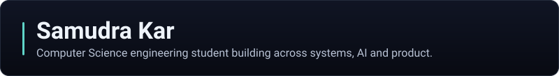
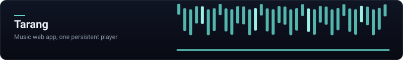
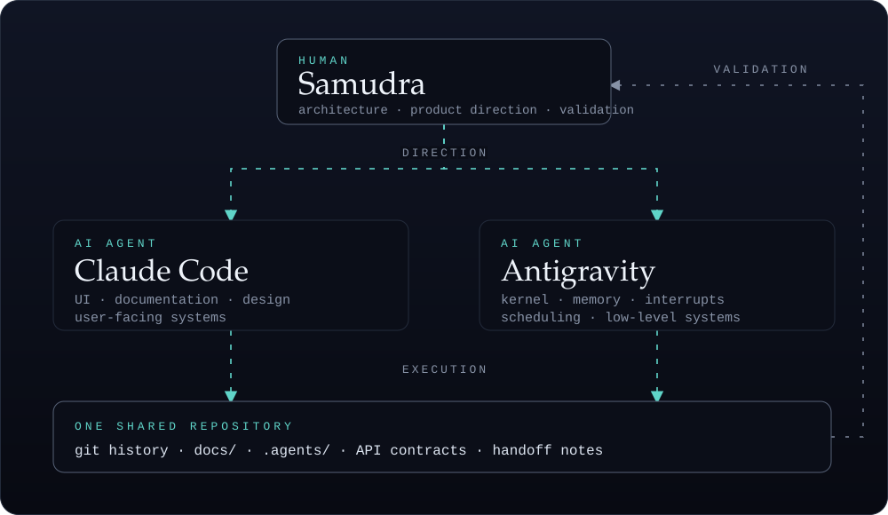

<h1></h1>

## Currently building

A real x86-64 operating system, built from first principles. It boots into long mode, manages physical and virtual memory, handles CPU exceptions and hardware interrupts, and runs a preemptive scheduler over kernel tasks. Early user-mode support has started: Ring 3, per-process address spaces and a small system-call interface. A filesystem, networking and a desktop are still to come. 
C · x86-64 assembly · Clang / LLD / NASM · QEMU &nbsp;·&nbsp; [GitHub ↗](https://github.com/Samudra-GITHub/Samagra-OS)

## Selected work

Mine safety and compliance monitoring: explainable risk scores, a tamper-evident audit log, and a copilot limited to permission-scoped data. Built for the Smart India Hackathon. 
Next.js · Prisma · PostgreSQL · Docker &nbsp;·&nbsp; [GitHub ↗](https://github.com/Samudra-GITHub/PRAHARI)

A PyTorch U-Net prototype that reconstructs cloud-covered Sentinel-2 satellite scenes. Built for ISRO Hackathon 2026, and trained on a tiny sample set. 
PyTorch · scikit-image · Flask &nbsp;·&nbsp; [GitHub ↗](https://github.com/Samudra-GITHub/AkashaLens)

A music web app built around one persistent player that expands into a full now-playing view, with time-synced lyrics and a documented design system. Frontend only, on seed data. 
Next.js · TypeScript · Framer Motion · Zustand &nbsp;·&nbsp; [GitHub ↗](https://github.com/Samudra-GITHub/Tarang) &nbsp;·&nbsp; [Live ↗](https://tarang-ecru.vercel.app)

A chat workspace with per-user memory, cited multi-step research and real account sessions: Argon2 hashing, HttpOnly cookies, CSRF checks. 
FastAPI · Next.js · Groq · Tavily &nbsp;·&nbsp; [GitHub ↗](https://github.com/Samudra-GITHub/Rinti-Ai) &nbsp;·&nbsp; [Live ↗](https://rinti-ai.vercel.app)

A personal dashboard that borrows from operating-system design. An interface exploration with mock data, not a real operating system. 
Next.js · TypeScript · Framer Motion &nbsp;·&nbsp; [GitHub ↗](https://github.com/Samudra-GITHub/orbit-os)

## Engineering with AI

Claude Code and Antigravity are AI engineering agents, not people. I use them as part of my workflow, not as a replacement for engineering decisions: I set architecture, direction and validation, and they implement. They coordinate through the repository itself: shared docs, interface contracts, handoff notes and commits.

## Stack

**Languages** &nbsp; TypeScript · JavaScript · Python · C · x86-64 Assembly 
**Systems** &nbsp; Clang · LLD · NASM · QEMU · Git · Docker 
**Web** &nbsp; React · Next.js · Tailwind · Framer Motion · GSAP · Three.js 
**AI / Vision** &nbsp; PyTorch · NumPy · SciPy · scikit-image · LLM APIs 
**Design** &nbsp; Figma · Design Systems · Motion Design

**Interests** &nbsp; Systems · AI / Computer Vision · Product Engineering · UI / UX · Developer Tools

---

[Portfolio](https://sam-sportfolio.vercel.app) &nbsp;·&nbsp; [LinkedIn](https://www.linkedin.com/in/samudra-kar-a495951b5/) &nbsp;·&nbsp; [GitHub](https://github.com/Samudra-GITHub) &nbsp;·&nbsp; [Email](mailto:hi.samsstudio@gmail.com) &nbsp;·&nbsp; Bangalore, India &nbsp;·&nbsp; Chanakya University &nbsp;·&nbsp; Open to internships
