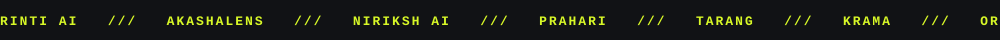
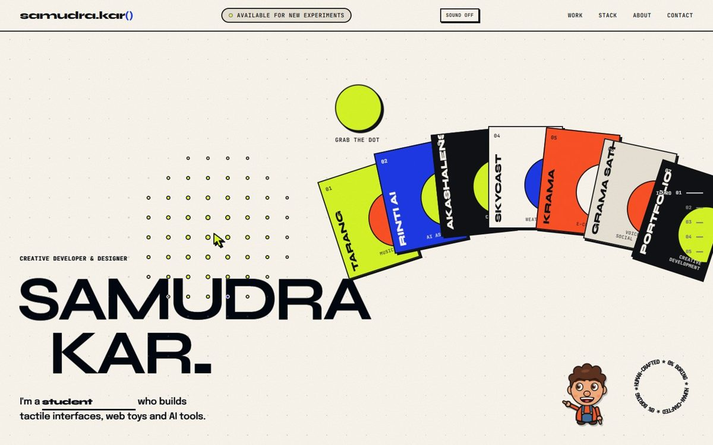
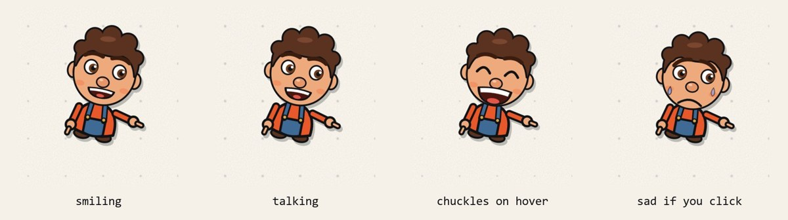
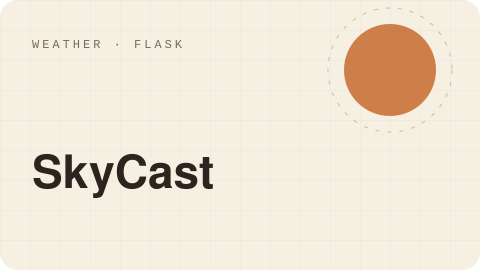
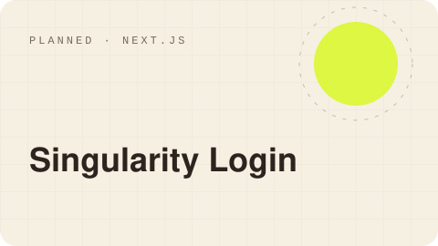
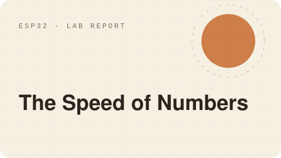
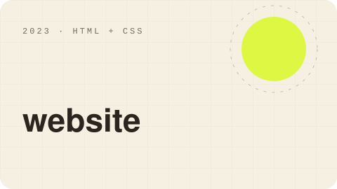
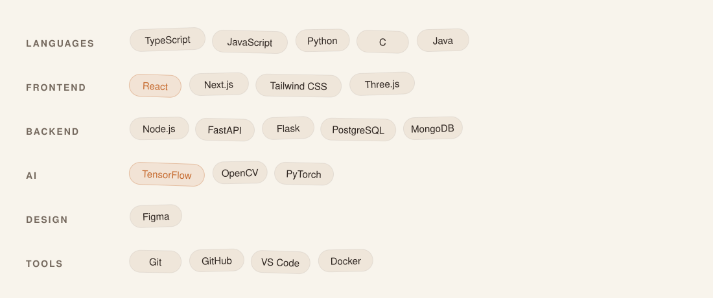
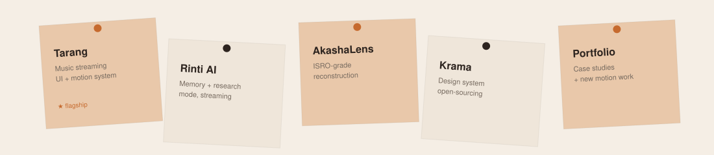

  



 

 <a href="mailto:hi.samsstudio@gmail.com">Email</a> &nbsp;·&nbsp;
 <a href="https://github.com/Samudra-GITHub">GitHub</a> &nbsp;·&nbsp;
 <a href="https://www.linkedin.com/in/samudra-kar-a495951b5/">LinkedIn</a> &nbsp;·&nbsp;
 <a href="https://www.instagram.com/samudra_kar/">Instagram</a> &nbsp;·&nbsp;
 <a href="https://sam-sportfolio.vercel.app">Portfolio</a>

 

<a href="#about">👋 About</a> &nbsp;·&nbsp;
<a href="#the-studio-all-at-once">🌌 The Studio</a> &nbsp;·&nbsp;
<a href="#featured-products">🧩 Featured</a> &nbsp;·&nbsp;
<a href="#more-builds">🧪 More Builds</a> &nbsp;·&nbsp;
<a href="#tech-stack">🛠️ Stack</a> &nbsp;·&nbsp;
<a href="#github-journey">🧭 Journey</a> &nbsp;·&nbsp;
<a href="#currently-building">🚧 Building</a> &nbsp;·&nbsp;
<a href="#connect">📬 Connect</a>

  

## 👋 About

I'm a Computer Science Engineering student, UI/UX designer, and full-stack builder working out of Bangalore. Somewhere along the way I picked up a camera too, and now half my reference folders are photos I took myself instead of screenshots I saved.

Most of what I build lives at the edge of a few things at once — product thinking, visual design, and enough engineering to actually ship it. I like AI best when it disappears into the product instead of being the headline. A copilot is more interesting to me than a chatbot; a recommendation is more interesting than a leaderboard.

I'm slow to add a feature and quick to cut one. If two things compete for attention on a screen, one of them loses.

 

<em>"Build the thing you'd actually want to open twice."</em>

  

## 🌌 The Studio, All at Once

Everything under **Sams Studio** in one orbit: AI and research close to the core, products and interfaces in the middle, sites and experiments on the rim. Every dot is a repository on this account.

  

  

## 🧩 Featured Products

Every clip and screenshot below was captured from the project running locally. Nothing here is a mock-up.

 

<table width="100%">
<tr>
<td width="55%" valign="top">

</td>
<td width="45%" valign="top">

 

SAMS STUDIO &nbsp;·&nbsp; FLAGSHIP

### 🎵 Tarang
**Music, redesigned for the web.**

A music-first streaming web app: a persistent floating player that expands into a full now-playing view with a waveform, queue, time-synced lyrics and translations, plus playlists, moods, listening stats and a documented design system.

 

`Next.js` `React` `TypeScript` `Tailwind CSS` `Framer Motion` `Zustand`

 

 **[View Live →](https://tarang-ecru.vercel.app)** &nbsp;·&nbsp;
 **[Repository →](https://github.com/Samudra-GITHub/Tarang)**

</td>
</tr>
</table>

 

<table width="100%">
<tr>
<td width="45%" valign="top">

 

SAMS STUDIO &nbsp;·&nbsp; AI

### 🤖 Rinti AI
**Your intelligent AI workspace.**

A chat workspace with per-user memory, a cited multi-step research mode and real account sessions: Argon2 password hashing, HttpOnly cookies and CSRF checks. Groq or any OpenAI-compatible model for chat, Tavily for research.

 

`FastAPI` `Python` `Next.js` `Groq` `Tavily` `Postgres`

 

 **[View Live →](https://rinti-ai.vercel.app)** &nbsp;·&nbsp;
 **[Repository →](https://github.com/Samudra-GITHub/Rinti-Ai)**

</td>
<td width="55%" valign="top" align="center">

 

The sign-in and register screens. The rest of the app sits behind the login.

</td>
</tr>
</table>

 

<table width="100%">
<tr>
<td width="55%" valign="top" align="center">

 

Dataset samples (cloudy and clear), not model output.

</td>
<td width="45%" valign="top">

 

SAMS STUDIO &nbsp;·&nbsp; RESEARCH

### 🛰️ AkashaLens
**Cloud removal for satellite imagery.**

A PyTorch U-Net prototype that reconstructs cloud-occluded Sentinel-2 scenes, with a rule-based cloud mask, a confidence heatmap and MAE, PSNR and SSIM evaluation behind a Flask demo. Built for ISRO Hackathon 2026.

 

`PyTorch` `Flask` `scikit-image` `SciPy` `Sentinel-2`

 

 **[View Repository →](https://github.com/Samudra-GITHub/AkashaLens)**

</td>
</tr>
</table>

 

<table width="100%">
<tr>
<td width="45%" valign="top">

 

SAMS STUDIO &nbsp;·&nbsp; FASHION

### 👟 Krama
**A sneaker storefront designed like an editorial.**

Shop and filters, product pages with a rotatable viewport, a cart drawer, multi-step checkout, an account area and an admin console for drops, with motion driven by GSAP, Motion and Lenis. Runs entirely on seed data.

 

`Next.js` `GSAP` `Motion` `Lenis` `Zustand` `Tailwind CSS`

 

 **[View Repository →](https://github.com/Samudra-GITHub/Krama)**

</td>
<td width="55%" valign="top">

</td>
</tr>
</table>

 

<table width="100%">
<tr>
<td width="55%" valign="top">

</td>
<td width="45%" valign="top">

 

SAMS STUDIO &nbsp;·&nbsp; INTERFACE

### 🖥️ Orbit OS
**A personal dashboard that behaves like an operating system.**

Glass widgets, an AI workspace, notes, files and a Kanban board, a command palette and a notification center, in a dark "Liquid Spatial UI" with spring motion. An interface exploration, with mock data.

 

`Next.js` `React` `Framer Motion` `GSAP` `Tailwind CSS`

 

 **[View Repository →](https://github.com/Samudra-GITHub/orbit-os)**

</td>
</tr>
</table>

 

<table width="100%">
<tr>
<td width="45%" valign="top">

 

SAMS STUDIO &nbsp;·&nbsp; BRAND + ENGINEERING

### ☕ Noir Café
**A café that exists only as a website.**

A specialty-coffee brand designed and engineered end to end: four languages and four currencies, an installable offline PWA, ordering and table booking, an AI barista and a scroll-driven 3D cup. Every integration is optional.

 

`Next.js 16` `Three.js` `Framer Motion` `Lenis` `Supabase` `Stripe`

 

 **[View Repository →](https://github.com/Samudra-GITHub/noir-cafe)**

</td>
<td width="55%" valign="top">

</td>
</tr>
</table>

 

<table width="100%">
<tr>
<td width="55%" valign="top">

<a href="https://sam-sportfolio.vercel.app"></a>

</td>
<td width="45%" valign="top">

 

SAMS STUDIO &nbsp;·&nbsp; HOME

### 🎨 Portfolio
**Every project is its own small world.**

My personal site, rebuilt as a scroll-driven, cursor-aware experience: seven project worlds with their own motion, a Toolbox sticker sheet generated from the real tech in each project, a social-first contact scene with a 3D orb, and a little cartoon buddy who wanders the page, points at your cursor, and gets sad if you click him. Raw WebGL shaders, no Three.js.

 

`React` `TypeScript` `GSAP` `Lenis` `Framer Motion` `WebGL`

 

 **[View Live →](https://sam-sportfolio.vercel.app)** &nbsp;·&nbsp;
 **[Repository →](https://github.com/Samudra-GITHub/Sam-s_Portfolio)**

</td>
</tr>
</table>

 


 
<em>Meet the buddy. He lives on the site, follows you around, points at your cursor, laughs when hovered and gets sad when clicked.</em>

 

## 🧪 More Builds

The rest of the lineup. Where a repo has real captures they are shown; where it doesn't, the tile is typography, not a fake screenshot.

 

<table width="100%">
<tr>
<td width="50%" valign="top">

### 📡 [Niriksh AI](https://github.com/Samudra-GITHub/Niriksh-AI)
An AI copilot that helps merchants investigate failed or flagged transactions and trigger recovery, by text or voice in five Indian languages. FastAPI, Sarvam AI, Cognee memory and an n8n workflow behind a Next.js dashboard. Built for a payments hackathon.

</td>
<td width="50%" valign="top">

### 🛡️ [PRAHARI](https://github.com/Samudra-GITHub/PRAHARI)
Mine compliance and safety monitoring with explainable risk scoring, automatic alerts, a hash-chained audit log and a copilot that can only narrate real, permission-scoped data. Next.js, Prisma and PostgreSQL in Docker. Built for the Smart India Hackathon.

</td>
</tr>
<tr>
<td width="50%" valign="top">

### 🧇 [The Waffle House](https://github.com/Samudra-GITHub/the-waffle-house) &nbsp;[live ↗](https://the-waffle-house.vercel.app)
A one-page site for a Belgian waffle café in Siliguri: animated hero, menu carousel, gallery with lightbox, reviews and a map. React, Framer Motion and Tailwind.

</td>
<td width="50%" valign="top">

### 🌐 [Portfolio V2](https://github.com/Samudra-GITHub/samudra-kar-portfolio)
An earlier take on the portfolio with one persistent React Three Fiber scene, custom shaders, adaptive quality by device tier and procedural Web Audio sound.

</td>
</tr>
<tr>
<td width="50%" valign="top">

<a href="https://github.com/Samudra-GITHub/SkyCast-Weather-App"></a>

### 🌤️ [SkyCast](https://github.com/Samudra-GITHub/SkyCast-Weather-App)
One screen of weather: current conditions, forecast, UV and air quality for any city, from a small Flask app over OpenWeatherMap with an animated sky canvas.

</td>
<td width="50%" valign="top">

<a href="https://github.com/Samudra-GITHub/singularity-login"></a>

### 🔐 [Singularity Login](https://github.com/Samudra-GITHub/singularity-login)
A planned glassmorphism login and register component set for Next.js. The repository has no code yet, only the intent.

</td>
</tr>
<tr>
<td width="50%" valign="top">

<a href="https://github.com/Samudra-GITHub/speed-of-numbers-fca"></a>

### 🔬 [The Speed of Numbers](https://github.com/Samudra-GITHub/speed-of-numbers-fca)
A team lab on numerical representation and execution latency on the ESP32 (Xtensa LX6 at 240 MHz): an Arduino sketch, raw experiment data and a LaTeX report.

</td>
<td width="50%" valign="top">

<a href="https://github.com/Samudra-GITHub/website"></a>

### 🕰️ [website](https://github.com/Samudra-GITHub/website)
Where it started: a small static personal site in plain HTML and CSS from 2023.

</td>
</tr>
</table>

📚 <a href="https://github.com/Samudra-GITHub?tab=repositories"><b>All repositories →</b></a>

 

<table width="100%"><tr>
<td width="60%"><h2>🛠️ Tech Stack</h2></td>
<td width="40%" align="right"><em>Not a skill wall — the actual tools behind every product on this page.</em></td>
</tr></table>



 

## 🧭 GitHub Journey



 

## 🚧 Currently Building



<em>Tarang gets the most hours. Everything else gets whatever's left.</em>

 

## 🎧 Now Playing

  

 

## 📊 GitHub Analytics

<em>Building consistently. Shipping in public.</em>

 
 

<picture>
  <source media="(prefers-color-scheme: dark)" srcset="https://raw.githubusercontent.com/Samudra-GITHub/Samudra-GITHub/output/github-contribution-grid-snake-dark.svg" />
  <source media="(prefers-color-scheme: light)" srcset="https://raw.githubusercontent.com/Samudra-GITHub/Samudra-GITHub/output/github-contribution-grid-snake.svg" />
  
</picture>

 

## 📬 Connect

 <a href="mailto:hi.samsstudio@gmail.com">Email</a> &nbsp;·&nbsp;
 <a href="https://github.com/Samudra-GITHub">GitHub</a> &nbsp;·&nbsp;
 <a href="https://www.linkedin.com/in/samudra-kar-a495951b5/">LinkedIn</a> &nbsp;·&nbsp;
 <a href="https://www.instagram.com/samudra_kar/">Instagram</a> &nbsp;·&nbsp;
 <a href="https://sam-sportfolio.vercel.app">Portfolio</a>

  

<em>See you in the next build.</em>

 

— Samudra Kar, Sams Studio

