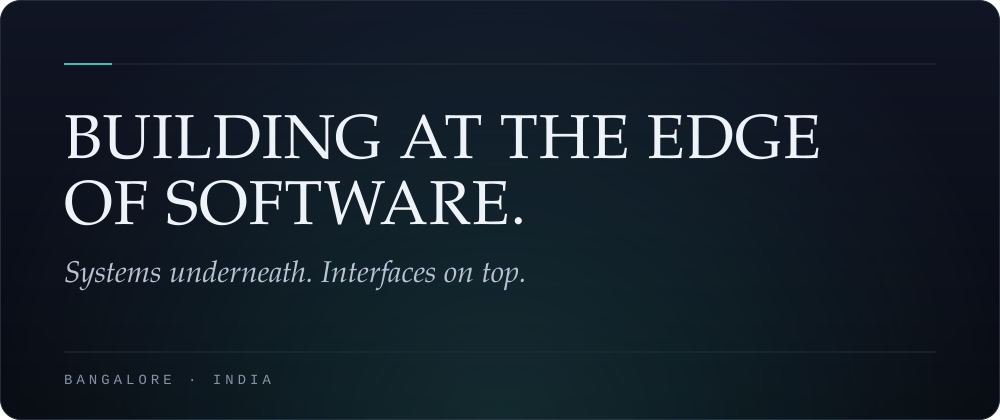

<h1 align="center"></h1>

## 01 / CURRENTLY BUILDING

**[SAMAGRA OS](https://github.com/Samudra-GITHub/Samagra-OS) &nbsp;·&nbsp; समग्र OS.** A real x86-64 operating system, built from first principles. It boots into long mode, manages physical and virtual memory, handles CPU exceptions and hardware interrupts, and runs a preemptive round-robin scheduler over kernel tasks, all tested in QEMU. Keyboard input is basic. There is no user space, filesystem, networking or desktop yet, and the README says so. 
C · X86-64 ASSEMBLY · CLANG / LLD / NASM · QEMU &nbsp;·&nbsp; BUILT WITH A HUMAN-DIRECTED AI WORKFLOW, SEE [03](#03--engineering-with-ai)

## 02 / SELECTED WORK

**01 &nbsp; PRAHARI** &nbsp;·&nbsp; [GitHub ↗](https://github.com/Samudra-GITHub/PRAHARI) 
Mine safety and compliance monitoring: explainable risk scores, a tamper-evident audit log, and a copilot limited to permission-scoped data. Built for the Smart India Hackathon. 
NEXT.JS · PRISMA · POSTGRESQL · DOCKER

**02 &nbsp; AKASHALENS** &nbsp;·&nbsp; [GitHub ↗](https://github.com/Samudra-GITHub/AkashaLens) 
Cloud removal for satellite imagery: a PyTorch U-Net prototype that reconstructs cloud-covered Sentinel-2 scenes. Built for ISRO Hackathon 2026, trained on a tiny sample set. 
PYTORCH · SCIKIT-IMAGE · FLASK

**03 &nbsp; TARANG** &nbsp;·&nbsp; [GitHub ↗](https://github.com/Samudra-GITHub/Tarang) &nbsp;·&nbsp; [Live ↗](https://tarang-ecru.vercel.app) 
A music web app built around one persistent player that expands into a full now-playing view, with time-synced lyrics and a documented design system. Frontend only, on seed data. 
NEXT.JS · TYPESCRIPT · FRAMER MOTION · ZUSTAND

**04 &nbsp; RINTI AI** &nbsp;·&nbsp; [GitHub ↗](https://github.com/Samudra-GITHub/Rinti-Ai) &nbsp;·&nbsp; [Live ↗](https://rinti-ai.vercel.app) 
A chat workspace with per-user memory, cited multi-step research and real account sessions: Argon2 hashing, HttpOnly cookies, CSRF checks. 
FASTAPI · NEXT.JS · GROQ · TAVILY

**05 &nbsp; ORBIT OS** &nbsp;·&nbsp; [GitHub ↗](https://github.com/Samudra-GITHub/orbit-os) 
A personal dashboard that borrows from operating-system design. An interface exploration with mock data, not a real operating system. 
NEXT.JS · TYPESCRIPT · FRAMER MOTION

## 03 / ENGINEERING WITH AI

**HUMAN DIRECTION × AI EXECUTION.** Claude Code and Antigravity are AI engineering agents, not people. I use them as part of my workflow, not as a replacement for engineering decisions. They coordinate through the repository itself: shared docs, interface contracts, handoff notes and commits.

## 04 / STACK

**LANGUAGES** &nbsp; TypeScript · JavaScript · Python · C · x86-64 Assembly 
**SYSTEMS** &nbsp; Clang · LLD · NASM · QEMU · Git · Docker 
**WEB** &nbsp; React · Next.js · Tailwind · Framer Motion · GSAP · Three.js 
**AI / VISION** &nbsp; PyTorch · NumPy · SciPy · scikit-image · LLM APIs 
**DESIGN** &nbsp; Figma · Design Systems · Motion Design

## 05 / INTERESTS

SYSTEMS · AI / COMPUTER VISION · PRODUCT ENGINEERING · UI / UX · DEVELOPER TOOLS

[ <a href="https://sam-sportfolio.vercel.app">Portfolio</a> ] &nbsp; [ <a href="https://www.linkedin.com/in/samudra-kar-a495951b5/">LinkedIn</a> ] &nbsp; [ <a href="https://github.com/Samudra-GITHub">GitHub</a> ] &nbsp; [ <a href="mailto:hi.samsstudio@gmail.com">Email</a> ] 
Computer Science Engineering · Chanakya University · Open to internships

